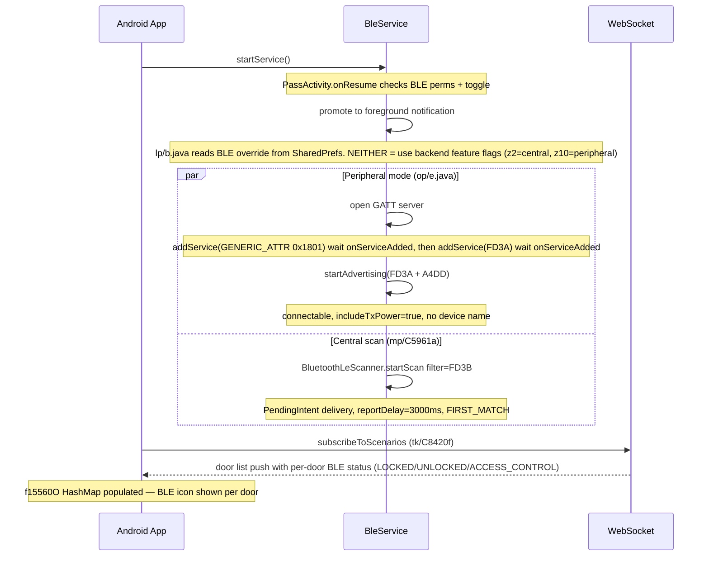
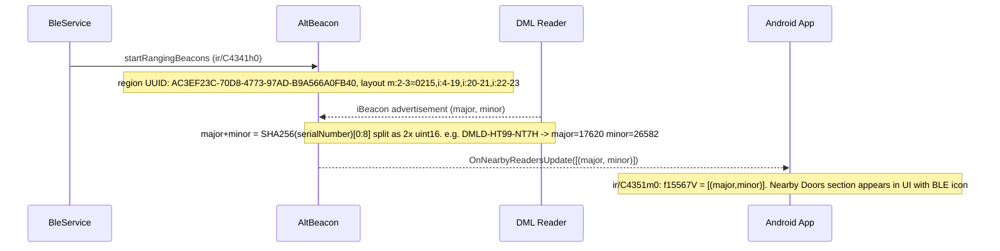
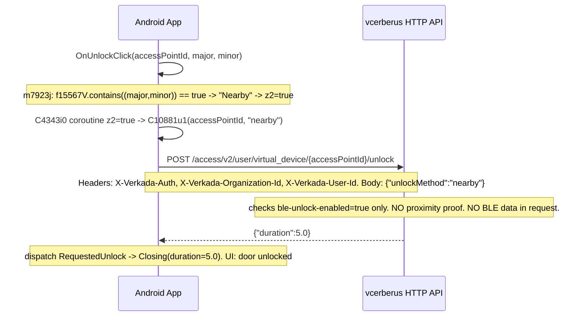
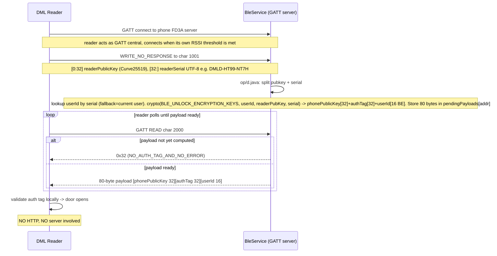

# Verkada Pass — Bluetooth Unlock Flow Diagrams

Two completely separate BLE unlock flows exist. They run **simultaneously and independently**.

| Flow | Trigger | Protocol | Server involved? |
|---|---|---|---|
| **Button-tap** | User taps; iBeacon detected nearby | HTTPS POST `{"unlockMethod":"nearby"}` | ✅ Yes |
| **Auto-proximity** | Reader RSSI threshold crossed (1–2 cm) | BLE GATT (FD3A) — fully local | ❌ No |

---

## Diagram 1 — BleService startup

Both BLE modes start simultaneously when `BleService` is created.



---

## Diagram 2 — Nearby door detection (AltBeacon iBeacon)

Determines which doors appear in the "Nearby Doors" UI section and enables `unlockMethod:"nearby"`.



---

## Diagram 3 — Button-tap unlock (HTTP, not BLE GATT)

Triggered when user taps the unlock button. Requires the door to be in the "Nearby Doors" section (iBeacon detected).



---

## Diagram 4 — Peripheral auto-unlock (BLE GATT, no button, no server)

Runs simultaneously with diagram 2 & 3. Phone advertises as peripheral; DML reader connects when close enough (~1–2 cm).



---

## GATT server characteristics (peripheral mode, from op/e.java)

| Char UUID | Property | Permission | Direction |
|---|---|---|---|
| `00001001` | `WRITE_NO_RESPONSE` (0x04) | `WRITE` (0x10) | Reader → Phone |
| `00002000` | `READ` (0x02) | `READ` (0x01) | Phone → Reader (polled) |

- **No NOTIFY / INDICATE** on char `2000` — reader must poll.
- Characteristics added in order: `2000` first, `1001` second.
- No CCCD descriptors needed on either characteristic.

## Advertisement (peripheral mode, from op/e.java k())

- Service UUIDs: `FD3A` + `A4DD`
- Connectable: yes
- Device name: **not included**
- TX power: **included** (`setIncludeTxPowerLevel(true)`)
- Mode: high frequency / low latency

## iBeacon → reader serial mapping (from ir/C4341h0.java)

```
SHA-256( serialNumber.UTF-8 )
  → hex-encode digest
  → take first 8 hex chars
  → split into two 16-bit unsigned ints = (major, minor)

Example:
  serial  DMLD-HT99-NT7H
  sha256  → 44d4...
  major   = 0x44d4 = 17620
  minor   = 0x67d6 = 26582 (next 4 hex chars)
```

Region UUID scanned by AltBeacon: `AC3EF23C-70D8-4773-97AD-B9A566A0FB40`

## BLE mode override (from lp/b.java + aq/C0669f.java SharedPrefs)

| Value | Behaviour |
|---|---|
| `"NEITHER"` (default) | Use backend feature flags: z2 = central, z10 = peripheral |
| `"OVERRIDE_TO_PERIPHERAL"` | Peripheral only |
| `"OVERRIDE_TO_CENTRAL"` | Central only |
| `"OVERRIDE_TO_BOTH"` | Both modes active |

## Server-side validation (confirmed live)

`RemoteUnlockRequest` has exactly **one field**: `unlockMethod: String`.  
`UnlockResponse` has exactly **one field**: `duration: double`.  
The server performs **zero proximity validation**. The `"nearby"` string is a permission key, not a location claim.  
Server only checks `ble-unlock-enabled=true` for the org.

Live-confirmed: `{"unlockMethod":"nearby"}` succeeds from outside Bluetooth range.
