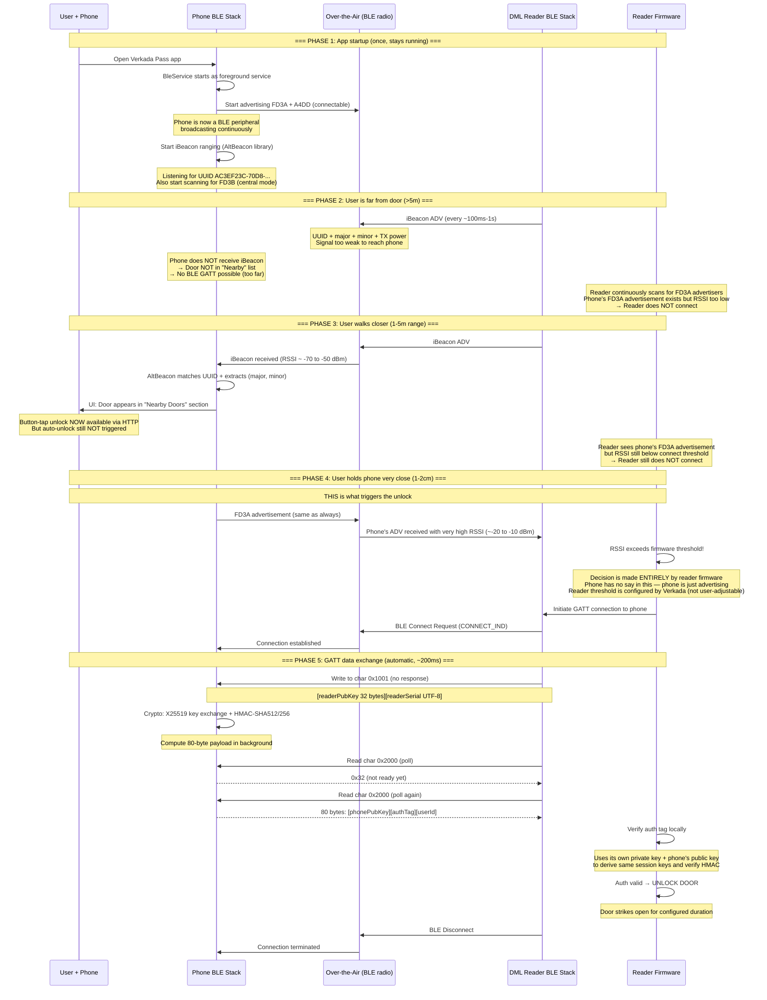
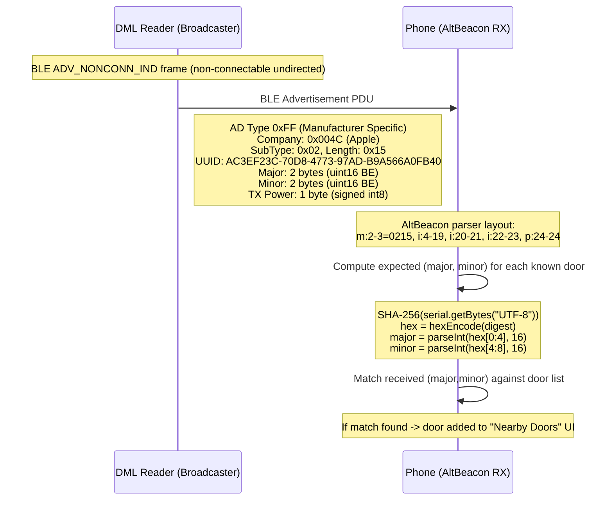
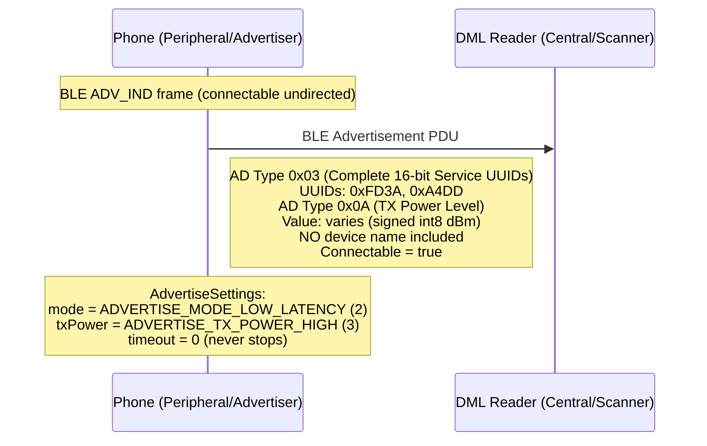
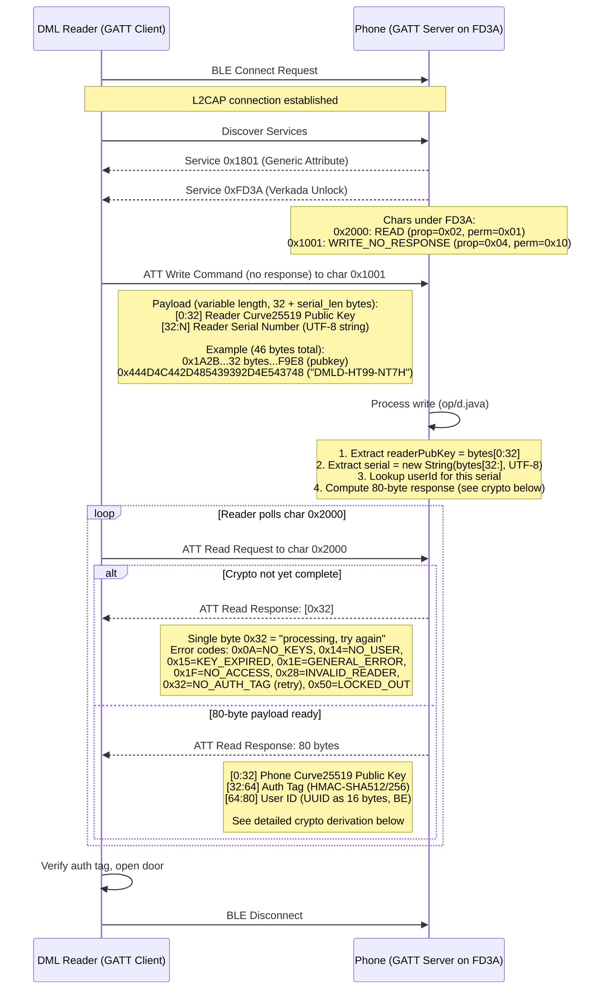
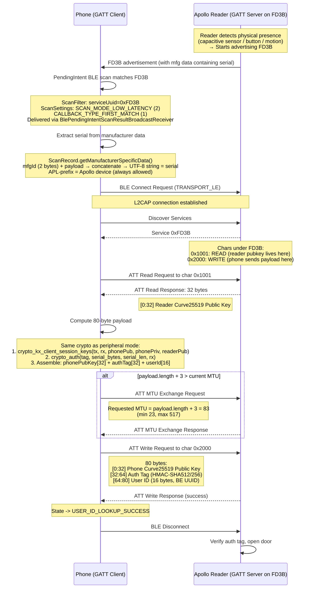
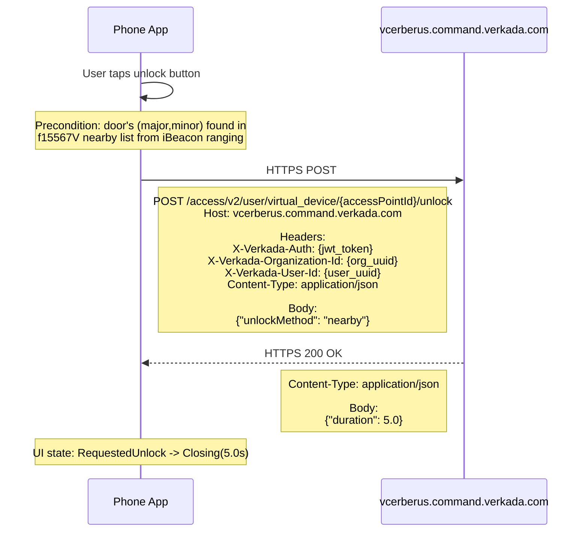
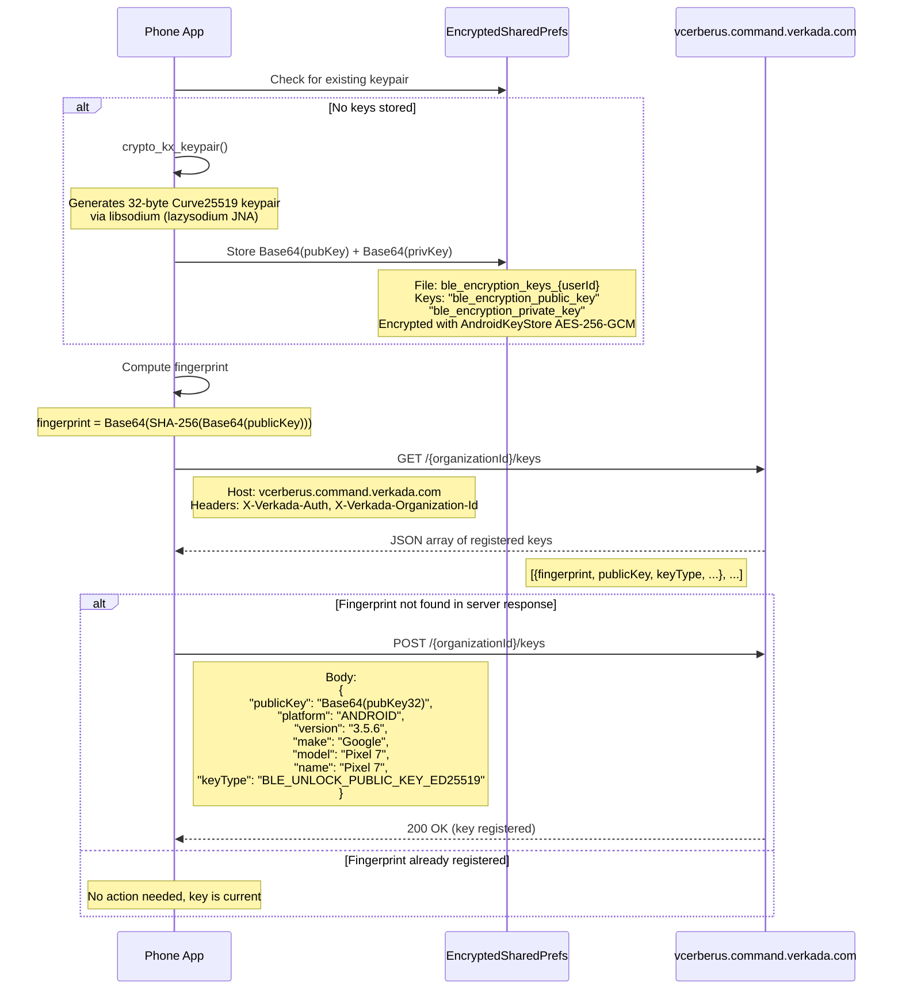

# Verkada Pass — BLE Unlock Wire-Level Data Flow Diagrams

Exact data flowing over each transport, showing direction and byte-level payloads.

---

## 0. Complete Physical Proximity Unlock — What Happens When You Approach a Door

This diagram explains the full user experience: why the door doesn't unlock when you're far away,
what exactly triggers it when you get close, and what protocol is used at each stage.

**Key insight:** There is NO NFC involved. The "tap" is purely BLE-based. The reader uses BLE RSSI
(signal strength) to determine physical proximity. The reader's firmware decides when to initiate
the GATT connection based on its own RSSI threshold — this is NOT controlled by the phone.



### Why doesn't it unlock when you're far away?

| Distance | What's happening | Why no unlock |
|---|---|---|
| >5m | Phone advertises FD3A. Reader broadcasts iBeacon. Both signals too weak to reach each other reliably. | No connection possible |
| 1-5m | Phone receives iBeacon → "Nearby" UI appears. Reader sees phone's FD3A but signal too weak. | Reader's RSSI threshold not met → no GATT connect |
| 1-2cm | Reader receives phone's FD3A at very high signal strength (-20 to -10 dBm) | **Reader firmware triggers GATT connection** → unlock proceeds |

### What is the "tap" / "wave"?

**It's NOT NFC.** It's standard BLE (Bluetooth Low Energy) at very close range. The mechanism is:

1. Phone continuously broadcasts BLE advertisements (service UUID `FD3A`)
2. Reader continuously scans for `FD3A` advertisements
3. Reader firmware has an **RSSI threshold** (signal strength cutoff) — configured by Verkada
4. When the phone is held extremely close (~1-2cm), the BLE signal arrives at very high power
5. Reader detects RSSI above threshold → initiates GATT connection → data exchange → door unlocks

The phone does **nothing active** to trigger this. It's passive — just advertising. The reader makes the decision.

### Central mode trigger (Apollo readers)

For Apollo readers (serial starts with `APL`), the trigger works differently:

1. Reader advertises service `FD3B` when it detects something nearby (capacitive sensor / button press / motion)
2. Phone's background scan picks up `FD3B` advertisement
3. Phone initiates GATT connection to reader (phone is client)
4. Same 80-byte payload exchange, just reversed transport direction

The phone's scan for `FD3B` runs continuously via `PendingIntent` — it works even with the app in background.

---

## 1. iBeacon Advertisement (Reader → Phone, over-the-air)

The DML reader continuously broadcasts standard Apple iBeacon frames. The phone passively receives them.



### iBeacon PDU byte layout (31 bytes payload)

```
Offset  Bytes  Field
------  -----  -----
0-1     02 01  AD Length=2, AD Type=Flags
2       06     Flags (LE General + BR/EDR Not Supported)
3-4     1A FF  AD Length=26, AD Type=0xFF (Manufacturer Specific)
5-6     4C 00  Company ID: Apple (0x004C, little-endian)
7       02     iBeacon subtype
8       15     iBeacon data length (21 bytes)
9-24    AC3E.. Proximity UUID: AC3EF23C-70D8-4773-97AD-B9A566A0FB40
25-26   XX XX  Major (big-endian uint16)
27-28   YY YY  Minor (big-endian uint16)  
29      ZZ     Measured TX Power at 1m (signed int8, dBm)
```

---

## 2. Phone BLE Advertisement (Phone → Reader, peripheral mode)

The phone advertises to let nearby readers discover and connect to it.



---

## 3. Peripheral Mode GATT Unlock (Reader → Phone → Reader)

Phone is GATT **server**. Reader is GATT **client**. No internet involved.



### 80-byte response payload breakdown

```
Offset  Length  Field                    Derivation
------  ------  -----                    ----------
0-31    32      phonePublicKey           From EncryptedSharedPrefs (Curve25519 pub)
32-63   32      authTag                  crypto_auth(serial_bytes, rx_key)
64-79   16      userId                   UUID.toBigEndianBytes()

userId encoding (op/d.java):
  ByteBuffer bb = ByteBuffer.allocate(16)
  bb.order(BIG_ENDIAN)
  bb.putLong(uuid.getMostSignificantBits())   // bytes 0-7
  bb.putLong(uuid.getLeastSignificantBits())  // bytes 8-15
```

### Crypto derivation detail

```
Inputs:
  phonePrivKey[32]   — from EncryptedSharedPrefs "ble_encryption_private_key"
  phonePubKey[32]    — from EncryptedSharedPrefs "ble_encryption_public_key"  
  readerPubKey[32]   — received in char 1001 write
  serial             — received in char 1001 write (UTF-8 string)

Step 1: X25519 Key Exchange (libsodium crypto_kx)
  crypto_kx_client_session_keys(
    tx[32],          ← output (UNUSED)
    rx[32],          ← output (this is the auth key)
    phonePubKey,     ← phone is "client"
    phonePrivKey,
    readerPubKey     ← reader is "server"
  )
  
  Internally: shared = X25519(phonePrivKey, readerPubKey)
              BLAKE2B-512(phonePubKey || readerPubKey || shared)
              rx = first 32 bytes, tx = last 32 bytes

Step 2: Auth Tag (libsodium crypto_auth = HMAC-SHA512/256)
  crypto_auth(
    authTag[32],             ← output
    serial.getBytes("UTF-8"),← message (reader serial as bytes)
    serial.length,           ← message length
    rx[32]                   ← key from step 1
  )
```

---

## 4. Central Mode GATT Unlock (Phone → Reader → Phone)

Phone is GATT **client**. Reader is GATT **server**. No internet involved.  
Roles of characteristics are **reversed** from peripheral mode.

**Trigger:** The reader (typically Apollo, serial starts `APL`) begins advertising `FD3B` when it
detects physical presence — likely via capacitive touch sensor, IR motion sensor, or button press
on the reader hardware. This is reader firmware behavior, not controlled by the phone. The phone's
background scan picks it up automatically.



### Central mode characteristic roles (reversed!)

| Char UUID | On Reader (FD3B server) | Data | Direction |
|---|---|---|---|
| `0x1001` | READ | Reader's 32-byte Curve25519 public key | Reader → Phone |
| `0x2000` | WRITE | Phone's 80-byte unlock payload | Phone → Reader |

### Serial extraction from scan (np/C6484g.java)

```
ScanRecord manufacturer data structure:
  Key: manufacturer ID (uint16)
  Value: byte[] payload

Serial = new String(
  concat(
    shortToByteArray(manufacturerId),  // 2 bytes, big-endian
    manufacturerPayload                // N bytes
  ),
  "UTF-8"
)

Example: mfgId=0x4150 ("AP"), payload=[0x4C, ...] → "APL..."
```

---

## 5. Button-Tap HTTP Unlock (Phone → Server)

Uses HTTP, not BLE GATT. Only requires iBeacon proximity detection (Diagram 1).



### HTTP request/response exact fields

```
REQUEST:
  Method: POST
  Path:   /access/v2/user/virtual_device/<accessPointId>/unlock
  
  Headers:
    X-Verkada-Auth:            <JWT token string>
    X-Verkada-Organization-Id: <UUID string, e.g. "bbe18f9c-a606-4619-82e1-103c45f7b49e">
    X-Verkada-User-Id:         <UUID string>
    Content-Type:              application/json
  
  Body (JSON):
    {
      "unlockMethod": "nearby"   ← only valid value for BLE proximity unlock
    }

RESPONSE:
  Status: 200 OK
  
  Body (JSON):
    {
      "duration": 5.0            ← seconds the door stays unlocked (double)
    }

NOTE: Server performs ZERO proximity validation.
      "nearby" is a permission gate, not a location proof.
      Confirmed: works from any distance if iBeacon was seen at least once.
```

---

## 6. BLE Key Registration (Phone → Server, one-time setup)

Before any BLE unlock can work, the phone must register its public key with the server.



---

## Quick Reference: Data Direction Summary

```
┌─────────────────────────────────────────────────────────────────────┐
│                    PERIPHERAL MODE (FD3A)                            │
│                                                                     │
│  Reader ──[char 1001 WRITE]──► Phone                                │
│         readerPubKey[32] + serial[N]  (variable len)                │
│                                                                     │
│  Reader ◄──[char 2000 READ]─── Phone                                │
│         phonePubKey[32] + authTag[32] + userId[16]  (80 bytes)      │
│         OR error: single byte (0x0A/0x14/0x15/0x1E/0x1F/0x28/0x32) │
└─────────────────────────────────────────────────────────────────────┘

┌─────────────────────────────────────────────────────────────────────┐
│                    CENTRAL MODE (FD3B)                               │
│                                                                     │
│  Phone ◄──[char 1001 READ]─── Reader                                │
│         readerPubKey[32]  (32 bytes)                                │
│                                                                     │
│  Phone ──[char 2000 WRITE]──► Reader                                │
│         phonePubKey[32] + authTag[32] + userId[16]  (80 bytes)      │
└─────────────────────────────────────────────────────────────────────┘

┌─────────────────────────────────────────────────────────────────────┐
│                    HTTP BUTTON-TAP                                   │
│                                                                     │
│  Phone ──[HTTPS POST]──► Server                                     │
│         {"unlockMethod":"nearby"}                                   │
│                                                                     │
│  Phone ◄──[HTTPS 200]─── Server                                     │
│         {"duration":5.0}                                            │
└─────────────────────────────────────────────────────────────────────┘

┌─────────────────────────────────────────────────────────────────────┐
│                    iBEACON (passive, no connection)                  │
│                                                                     │
│  Reader ──[ADV broadcast]──► Phone                                  │
│         iBeacon: UUID + major[2] + minor[2] + txPower[1]           │
│         (phone never transmits back to reader for this)            │
└─────────────────────────────────────────────────────────────────────┘
```
