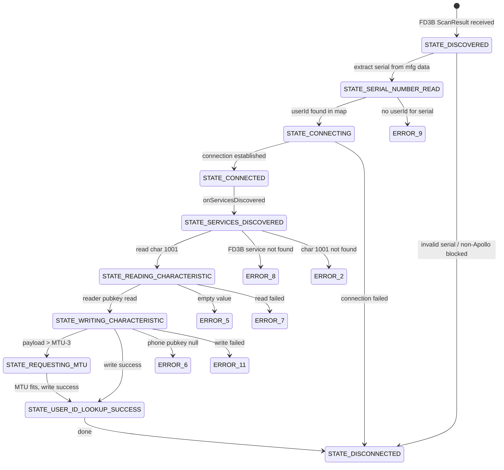
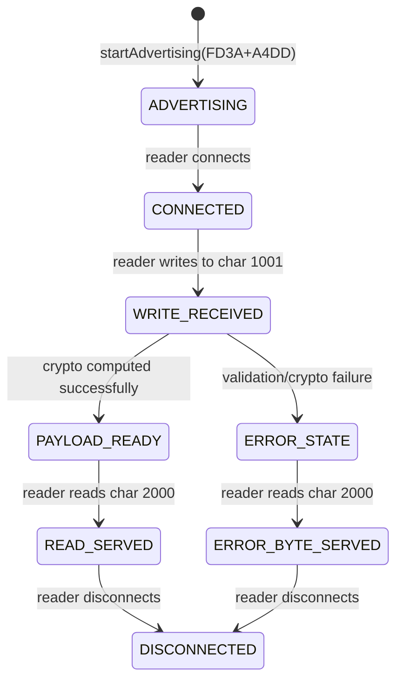

# Verkada Pass BLE Protocol — Deep Dive (from decompiled APK v3.5.6)

This document is a precise, source-level technical reference for both BLE unlock flows
extracted from the decompiled `com.verkada.VerkadaPass` APK. Every claim here is traceable
to a specific decompiled file and method.

---

## Table of Contents

1. [Architecture Overview](#architecture-overview)
2. [BLE Mode Selection (lp/b.java)](#ble-mode-selection)
3. [Peripheral Mode — GATT Server (op/ package)](#peripheral-mode)
4. [Central Mode — GATT Client (mp/ + np/ packages)](#central-mode)
5. [Cryptography (zp/i.java, lazysodium)](#cryptography)
6. [Key Registration (zp/h.java)](#key-registration)
7. [iBeacon / Nearby Detection (zp/t.java)](#ibeacon-nearby-detection)
8. [Button-Tap Unlock (HTTP, not BLE)](#button-tap-unlock)
9. [Error Codes](#error-codes)
10. [State Machine Diagram](#state-machine-diagram)

---

## Architecture Overview

```
┌─────────────────────────────────────────────────────────┐
│                    BleService (foreground)               │
│                                                         │
│  ┌──────────────────────┐  ┌─────────────────────────┐  │
│  │  Peripheral Mode     │  │  Central Mode           │  │
│  │  (op/e.java)         │  │  (mp/C5961a.java)       │  │
│  │                      │  │                         │  │
│  │  advertise FD3A+A4DD │  │  scan for FD3B          │  │
│  │  host GATT server    │  │  PendingIntent delivery │  │
│  │  chars: 1001, 2000   │  │  state machine (np/)    │  │
│  └──────────────────────┘  └─────────────────────────┘  │
│                                                         │
│  ┌──────────────────────────────────────────────────┐   │
│  │  AltBeacon iBeacon Ranging (zp/t.java)           │   │
│  │  UUID: AC3EF23C-70D8-4773-97AD-B9A566A0FB40     │   │
│  │  populates "Nearby Doors" UI section             │   │
│  └──────────────────────────────────────────────────┘   │
└─────────────────────────────────────────────────────────┘
```

---

## BLE Mode Selection

**Source:** `lp/b.java:45-106`

The BLE mode override is read from SharedPreferences:

| Override String | Behaviour |
|---|---|
| `"NEITHER"` (default) | Use backend feature flags: `z2`=central enabled, `z10`=peripheral enabled |
| `"OVERRIDE_TO_PERIPHERAL"` | Stop central, start peripheral only |
| `"OVERRIDE_TO_CENTRAL"` | Stop peripheral, start central only |
| `"OVERRIDE_TO_BOTH"` | Start both modes |

When `"NEITHER"` is set and both flags are false, peripheral mode is force-started as fallback.

---

## Peripheral Mode

### GATT Server Setup

**Source:** `op/e.java` method `l()`

```java
BluetoothGattService service = new BluetoothGattService(
    UUID.fromString("0000FD3A-0000-1000-8000-00805F9B34FB"),  // primary service
    BluetoothGattService.SERVICE_TYPE_PRIMARY
);

// char 2000: READ only — added FIRST
BluetoothGattCharacteristic readChar = new BluetoothGattCharacteristic(
    UUID.fromString("00002000-0000-1000-8000-00805F9B34FB"),
    BluetoothGattCharacteristic.PROPERTY_READ,           // 0x02
    BluetoothGattCharacteristic.PERMISSION_READ          // 0x01
);

// char 1001: WRITE_NO_RESPONSE only — added SECOND
BluetoothGattCharacteristic writeChar = new BluetoothGattCharacteristic(
    UUID.fromString("00001001-0000-1000-8000-00805F9B34FB"),
    BluetoothGattCharacteristic.PROPERTY_WRITE_NO_RESPONSE, // 0x04
    BluetoothGattCharacteristic.PERMISSION_WRITE            // 0x10
);

service.addCharacteristic(readChar);   // 2000 first
service.addCharacteristic(writeChar);  // 1001 second
gattServer.addService(service);
```

**Critical details:**
- Characteristic `2000`: **READ only** (property 0x02, permission 0x01). No NOTIFY, no INDICATE.
- Characteristic `1001`: **WRITE_NO_RESPONSE only** (property 0x04, permission 0x10). No WRITE with response.
- **Add order matters**: `2000` first, `1001` second.
- No CCCD descriptors on either characteristic.

### Advertising Setup

**Source:** `op/e.java` method `k()`

```java
AdvertiseSettings settings = new AdvertiseSettings.Builder()
    .setAdvertiseMode(AdvertiseSettings.ADVERTISE_MODE_LOW_LATENCY)   // 2
    .setTxPowerLevel(AdvertiseSettings.ADVERTISE_TX_POWER_HIGH)       // 3
    .setConnectable(true)
    .setTimeout(0)   // never timeout
    .build();

AdvertiseData data = new AdvertiseData.Builder()
    .setIncludeDeviceName(false)
    .setIncludeTxPowerLevel(true)
    .addServiceUuid(new ParcelUuid("0000FD3A-0000-1000-8000-00805F9B34FB"))
    .addServiceUuid(new ParcelUuid("0000A4DD-0000-1000-8000-00805F9B34FB"))
    .build();
```

| Parameter | Value |
|---|---|
| Connectable | `true` |
| Device Name | **not included** |
| TX Power Level | **included** (in data) |
| Advertise Mode | `LOW_LATENCY` (2) = fastest interval |
| TX Power | `HIGH` (3) = maximum transmit power |
| Timeout | `0` (never stops) |
| Service UUIDs | `FD3A` + `A4DD` |

### GATT Callback — Write to char 1001

**Source:** `op/d.java` — `onCharacteristicWriteRequest`

1. Only accepts writes to UUID `00001001-...`
2. If `preparedWrite=false` (WRITE_NO_RESPONSE): processes immediately via `a(device, value)`
3. If `preparedWrite=true`: accumulates chunks in `f13500a[deviceAddress]`, processes in `onExecuteWrite`
4. If `responseNeeded=true`: echoes back the received value bytes

### Core Processing — method `a(BluetoothDevice, byte[])`

**Source:** `op/d.java`

**Input format:** Reader writes to char `1001`:
```
[0:32]   readerPublicKey (Curve25519 public key, 32 bytes)
[32:end] readerSerial (UTF-8 string, e.g. "DMLD-HT99-NT7H")
```

**Processing steps:**
1. If `length < 32`: store error `REQUEST_VALUE_HAS_WRONG_SIZE (21)`, return
2. Split: `authValue = bytes[0:32]`, `readerSerial = String(bytes[32:], UTF-8)`
3. If serial empty: store error `REQUEST_READER_SERIAL_IS_EMPTY (22)`, return
4. Look up `readerSerial → userId` in ConcurrentHashMap `op/e.f13507a0`
5. If no mapping: store error `MISSING_USER_ID (10)`, attempt fallback to current active user via coroutine
6. If still no userId: log "No user id available...", return
7. Call crypto: `zp.i.a(new byte[32], new byte[32], authValue, "BLE_UNLOCK_ENCRYPTION_KEYS", userId, readerSerialBytes)`
8. Get phone public key: `zp.i.b("BLE_UNLOCK_ENCRYPTION_KEYS", userId).P`
9. If phone public key null: store error `FAILED_TO_RETRIEVE_ENCRYPTION_KEYS (31)`, return
10. Convert `userId` string to UUID, then to 16 bytes big-endian:
    ```java
    UUID uuid = UUID.fromString(userId);
    ByteBuffer.wrap(uuidBytes).order(BIG_ENDIAN)
        .putLong(uuid.getMostSignificantBits())
        .putLong(uuid.getLeastSignificantBits());
    ```
11. Build response: `phonePublicKey || authTag || uuidBytes` → store in `f13501b[deviceAddress]`

### GATT Callback — Read from char 2000

**Source:** `op/d.java` — `onCharacteristicReadRequest`

1. Only handles UUID `00002000-...`
2. If computed payload exists in `f13501b[deviceAddress]`:
   - Return slice from `offset` (handles multi-part BLE reads)
3. If no payload yet:
   - Return **1-byte** error status code from `f13502c[deviceAddress]`
   - If no error stored either: return `0x32` = `NO_AUTH_TAG_AND_NO_ERROR (50)`

**Response payload (80 bytes):**
```
Offset  Length  Content
0       32      phonePublicKey (Curve25519 public key)
32      32      authTag (HMAC from crypto_auth)
64      16      userId (UUID as 16 bytes, BIG_ENDIAN)
```

---

## Central Mode

### Scan Configuration

**Source:** `mp/C5961a.java` method `m10179c()` / `mp/a.java` method `c()`

```java
ScanFilter filter = new ScanFilter.Builder()
    .setServiceUuid(new ParcelUuid("0000FD3B-0000-1000-8000-00805F9B34FB"))
    .build();

ScanSettings settings = new ScanSettings.Builder()
    .setScanMode(ScanSettings.SCAN_MODE_LOW_LATENCY)  // 2
    .setCallbackType(ScanSettings.CALLBACK_TYPE_FIRST_MATCH)  // 1
    .setReportDelay(0)
    .build();

scanner.startScan(
    listOf(filter),
    settings,
    PendingIntent.getBroadcast(context, 0,
        new Intent(context, BlePendingIntentScanResultBroadcastReceiver.class),
        FLAG_UPDATE_CURRENT | FLAG_MUTABLE)  // 167772160 = 0x0A000000
);
```

| Parameter | Value |
|---|---|
| Service UUID filter | `0000FD3B-0000-1000-8000-00805F9B34FB` |
| Scan Mode | `LOW_LATENCY` (2) |
| Callback Type | `FIRST_MATCH` (1) |
| Report Delay | `0` (immediate) |
| Delivery | `PendingIntent` → `BlePendingIntentScanResultBroadcastReceiver` |

**UUID constants (from `mp/C5961a.java` / `mp/a.java` static init):**
- `f21428h` / `f11697h` = `0000FD3B-0000-1000-8000-00805F9B34FB` (service UUID for scan + discovery)
- `f21429i` / `f11698i` = `00001001-0000-1000-8000-00805F9B34FB` (read characteristic — reader public key)
- `f21430j` / `f11699k` = `00002000-0000-1000-8000-00805F9B34FB` (write characteristic — phone sends payload)

**Note:** In central mode, the roles are reversed from peripheral mode:
- `1001` is READ (phone reads reader's public key)
- `2000` is WRITE (phone writes the 80-byte auth payload)

### Central State Machine

**Source:** `np/` package — each class is one state

```
STATE_DISCOVERED (C6484g, case 0)
    ↓ onServicesDiscovered
    → Extract serial from manufacturer data
    → If serial starts with "APL": proceed (Apollo device)
    → Else if SharedPrefs override allows non-Apollo: proceed
    → Else: error state 4

STATE_SERIAL_NUMBER_READ (C6484g, case 2)
    ↓ lookup userId from ConcurrentHashMap[serial]
    → If found: transition to STATE_CONNECTING
    → If missing: error state 9

STATE_CONNECTING (C6480c, case 1)
    ↓ connection established
    → transition to STATE_CONNECTED

STATE_CONNECTED (C6480c, case 0)
    ↓ onServicesDiscovered (auto after connect)
    → transition to STATE_SERVICES_DISCOVERED

STATE_SERVICES_DISCOVERED (C6485h)
    ↓ find FD3B service → find char 1001
    → Verify char 1001 has READ property (bit 2)
    → Initiate read of char 1001
    → transition to STATE_READING_CHARACTERISTIC

STATE_READING_CHARACTERISTIC (C6480c, case 2)
    ↓ onCharacteristicRead returns reader public key bytes
    → If empty: error state 5
    → If read failed: error state 7
    → Pass bytes to STATE_WRITING_CHARACTERISTIC

STATE_WRITING_CHARACTERISTIC (C6486i / np/i)
    ↓ Compute 80-byte auth payload
    → Find FD3B service → find char 2000
    → Verify char 2000 has WRITE property (bit 8 or bit 4)
    → Check MTU: if payload > (MTU-3), → STATE_REQUESTING_MTU
    → Else: write payload with WRITE_TYPE_DEFAULT
    → On write success: → STATE_USER_ID_LOOKUP_SUCCESS (terminal, state 1)
    → On write failure: → error state 11

STATE_REQUESTING_MTU (C6484g, case 1)
    ↓ request MTU = payload.length + 3 (min 23, max 517)
    → onMtuChanged: re-attempt write if new MTU fits payload
    → If still too small: log error, abort
```

### Serial Number Extraction from Scan Record

**Source:** `np/C6484g.java` case 0 of `mo10755f()` (lines 152-179)

```java
ScanRecord scanRecord = scanResult.getScanRecord();
SparseArray<byte[]> mfgData = scanRecord.getManufacturerSpecificData();

// Concatenate manufacturer ID (2 bytes, little-endian) + payload
byte[] combined = null;
for each (key, value) in mfgData:
    byte b0 = (byte)(key & 0xFF);         // low byte of manufacturer ID
    byte b1 = (byte)((key >> 8) & 0xFF);  // high byte of manufacturer ID
    combined = concat([b0, b1], value);

String serial = new String(combined, StandardCharsets.UTF_8);
```

Then:
- If `serial.startsWith("APL")`: proceed as Apollo device
- Else: check SharedPrefs preference to allow non-Apollo devices (DML readers)

### Central Payload Computation

**Source:** `np/C6486i.java` method `mo10755f()` (lines 88-136)

```java
// 1. Get phone public key
byte[] phonePublicKey = crypto.b("BLE_UNLOCK_ENCRYPTION_KEYS", userId).P;  // 32 bytes

// 2. Get reader serial as UTF-8 bytes
byte[] serialBytes = readerSerial.getBytes(StandardCharsets.UTF_8);

// 3. Compute auth tag
//    bArr2 = reader public key bytes (read from char 1001)
byte[] authTag = crypto.a(new byte[32], new byte[32], readerPublicKey,
    "BLE_UNLOCK_ENCRYPTION_KEYS", userId, serialBytes);  // 32 bytes

// 4. Convert userId to 16 bytes big-endian
UUID uuid = UUID.fromString(userId);
byte[] uuidBytes = new byte[16];
ByteBuffer.wrap(uuidBytes).order(ByteOrder.BIG_ENDIAN)
    .putLong(uuid.getMostSignificantBits())
    .putLong(uuid.getLeastSignificantBits());

// 5. Concatenate
byte[] payload = concat(concat(phonePublicKey, authTag), uuidBytes);  // 80 bytes

// 6. Write to char 2000 on FD3B service
characteristic2000.setValue(payload);
peripheral.writeCharacteristic(characteristic2000);  // WRITE_TYPE_DEFAULT
```

---

## Cryptography

### Library

**Native libsodium** via JNA wrapper (`com.goterl.lazysodium.Sodium`).

**Source:** `com/goterl/lazysodium/Sodium.java`

```java
public abstract class Sodium {
    public native int crypto_kx_keypair(byte[] publicKey, byte[] secretKey);
    public native int crypto_kx_client_session_keys(byte[] rx, byte[] tx, byte[] clientPk, byte[] clientSk, byte[] serverPk);
    public native int crypto_auth(byte[] out, byte[] in, long inLen, byte[] key);
    public native int sodium_init();
}
```

### Key Generation

**Source:** `x2/n1.java` constructor (lines 18-27)

```java
public n1(byte[] pub, byte[] priv) {
    this.P = pub;   // public key
    this.Q = priv;  // private key
    if (pub == null || priv == null) {
        byte[] newPub = new byte[32];
        byte[] newPriv = new byte[32];
        sodium.crypto_kx_keypair(newPub, newPriv);
        this.P = newPub;
        this.Q = newPriv;
    }
}
```

This is a **Curve25519 key exchange keypair** (libsodium `crypto_kx_keypair` uses X25519).

### Key Storage

**Source:** `zp/i.java` method `b()` (lines 82-161)

Keys stored in **EncryptedSharedPreferences**:
- File name: `ble_encryption_keys_<userId>` (userId is the user's UUID string)
- Master key: Android Keystore alias `"_androidx_security_master_key_"` (AES-256-GCM)
- Key names:
  - `"ble_encryption_public_key"` → Base64-encoded 32-byte public key
  - `"ble_encryption_private_key"` → Base64-encoded 32-byte private key
- Encrypted pref keyset names:
  - `"__androidx_security_crypto_encrypted_prefs_key_keyset__"`
  - `"__androidx_security_crypto_encrypted_prefs_value_keyset__"`

### Auth Tag Computation

**Source:** `zp/i.java` method `a()` (lines 46-80)

```java
public byte[] a(byte[] txKey, byte[] rxKey, byte[] serverPublicKey,
               String featureName, String userId, byte[] readerSerialBytes) {

    // 1. Load phone keypair
    n1 keypair = b(featureName, userId);  // featureName = "BLE_UNLOCK_ENCRYPTION_KEYS"
    byte[] phonePubKey = keypair.P;       // 32 bytes
    byte[] phonePrivKey = keypair.Q;      // 32 bytes

    // 2. Derive session keys via X25519 key exchange
    //    phone is "client", reader is "server"
    int result = sodium.crypto_kx_client_session_keys(
        txKey,          // output: client→server session key (32 bytes) — NOT USED
        rxKey,          // output: server→client session key (32 bytes) — USED for auth
        phonePubKey,    // client public key
        phonePrivKey,   // client secret key
        serverPublicKey // server (reader) public key
    );
    if (result != 0) throw "failed to compute session keys";

    // 3. Compute HMAC-SHA512/256 auth tag over reader serial
    byte[] authTag = new byte[32];
    int result2 = sodium.crypto_auth(
        authTag,              // output: 32-byte tag
        readerSerialBytes,    // message: reader serial as UTF-8 bytes
        readerSerialBytes.length,
        rxKey                 // key: rx session key (server→client)
    );
    if (result2 != 0) throw "failed to compute auth tag";

    return authTag;  // 32 bytes
}
```

**Algorithm breakdown:**
1. `crypto_kx_client_session_keys` = X25519 Diffie-Hellman → BLAKE2b-based KDF → two 32-byte session keys
2. `crypto_auth` = HMAC-SHA512/256 (libsodium's `crypto_auth` uses HMAC-SHA-512-256 by default)
3. The **rx key** (server→client direction) is used as the HMAC key
4. The **message** being authenticated is the reader's serial number as UTF-8 bytes
5. The tx key is computed but not used in the payload

### Complete Crypto Flow Summary

```
phone_keypair = crypto_kx_keypair()                    → (phonePubKey[32], phonePrivKey[32])
(tx[32], rx[32]) = crypto_kx_client_session_keys(phonePubKey, phonePrivKey, readerPubKey)
authTag[32] = crypto_auth(readerSerial.UTF8, rx)       → HMAC-SHA512/256(serial, rxKey)
uuidBytes[16] = userId.toBigEndianBytes()

payload = phonePubKey[32] || authTag[32] || uuidBytes[16]  → 80 bytes total
```

---

## Key Registration

### Endpoint

**Source:** `zp/h.java` (lines 59-157), `com/verkada/passapp/network/routes/AuthKeyRoute.java`

```
GET  https://vcerberus.command.verkada.com/{organizationId}/keys
POST https://vcerberus.command.verkada.com/{organizationId}/keys
```

### Registration Flow

**Source:** `zp/h.java` case 0 (lines 78-157)

1. Load phone public key: `crypto.b("BLE_UNLOCK_ENCRYPTION_KEYS", userId).P`
2. Compute fingerprint:
   ```java
   String pubKeyBase64 = Base64.encodeToString(phonePublicKey, Base64.NO_WRAP);
   byte[] digest = SHA256(pubKeyBase64.getBytes(UTF_8));
   String fingerprint = Base64.encodeToString(digest, Base64.NO_WRAP);
   ```
   (The `du.m.E0()` + `wp.p(24)` pattern is Base64 encoding with flag 24 = NO_WRAP|URL_SAFE potentially)
3. `GET /{organizationId}/keys` → `PublicKeysResponse { keys: List<AccessOrgAuthKey> }`
4. Search for existing key matching `fingerprint` AND `keyType == "BLE_UNLOCK_PUBLIC_KEY_ED25519"`
5. If found: key already registered, done
6. If not found: register new key:

### Registration Request Body

**Source:** `RegisterPublicBleKeyRequest.java`, `RegisterPublicKeyRequest.java`

```json
{
  "publicKey": "<Base64-encoded 32-byte phone public key>",
  "platform": "ANDROID",
  "version": "<Build.VERSION.RELEASE>",
  "make": "<Build.MANUFACTURER>",
  "model": "<Build.MODEL>",
  "name": "<Build.MODEL>",
  "keyType": "BLE_UNLOCK_PUBLIC_KEY_ED25519"
}
```

**Note:** The key type constant is `"BLE_UNLOCK_PUBLIC_KEY_ED25519"` despite the key actually being Curve25519 (X25519). This is likely a naming convention in Verkada's backend that refers to the Ed25519/Curve25519 key family.

### Response

```json
{
  "keys": [
    {
      "fingerprint": "<SHA256 of Base64 public key>",
      "keyType": "BLE_UNLOCK_PUBLIC_KEY_ED25519",
      ...
    }
  ]
}
```

---

## iBeacon / Nearby Detection

### AltBeacon Configuration

**Source:** `zp/t.java` (lines 24-96)

```java
// Region for ranging
Region region = new Region(
    "com.verkada.reader",
    Identifier.parse("AC3EF23C-70D8-4773-97AD-B9A566A0FB40"),
    null,  // any major
    null   // any minor
);

// iBeacon parser layout
BeaconParser parser = new BeaconParser()
    .setBeaconLayout("m:2-3=0215,i:4-19,i:20-21,i:22-23,p:24-24");
parser.setHardwareAssistManufacturerCodes(new int[]{76});  // Apple manufacturer code
beaconManager.getBeaconParsers().add(parser);
```

| Parameter | Value |
|---|---|
| Region name | `"com.verkada.reader"` |
| UUID | `AC3EF23C-70D8-4773-97AD-B9A566A0FB40` |
| Layout | `m:2-3=0215,i:4-19,i:20-21,i:22-23,p:24-24` (standard iBeacon) |
| Manufacturer code | `76` (Apple — iBeacon standard) |
| Mode | **Ranging** (not monitoring) — gets continuous distance updates |

### Beacon → Door Mapping

**Source:** `zp/t.java` (lines 99-125)

The observer receives a `Collection<Beacon>` and extracts (major, minor) pairs:
```java
for (Beacon beacon : beacons) {
    int major = beacon.getId2().toInt();
    int minor = beacon.getId3().toInt();
    pairs.add(new Pair(major, minor));
}
// Emits to f15567V StateFlow → "Nearby Doors" section in UI
```

### Serial → Major/Minor Derivation

The mapping from `readerPeripherals.serialNumber` → iBeacon `(major, minor)` confirmed from earlier session analysis:

```
SHA-256(serialNumber.getBytes(UTF-8))
  → hex-encode full digest
  → take first 8 hex characters
  → split: chars [0:4] = major (uint16), chars [4:8] = minor (uint16)

Example:
  serial  = "DMLD-HT99-NT7H"
  SHA-256 = "44d467d6..."
  major   = 0x44d4 = 17620
  minor   = 0x67d6 = 26582
```

---

## Button-Tap Unlock

### Action Dispatch

**Source:** `ir/C4353o.java` — `OnUnlockClick(accessPointId, major, minor, location)`

### Nearby Determination

**Source:** `ir/C4351m0.java` method `m7923j()`

```java
if (f15567V.contains(new Pair(major, minor))) {
    return "Nearby";   // iBeacon ranged → allowed
}
int maxDist = f15569X;  // always -1 (never set)
if (location == null) {
    return maxDist == -1 ? "Inside" : "Unknown";
}
return (maxDist == -1 || location.distanceTo(doorLocation) <= maxDist)
    ? "Inside" : "Outside";
```

- `"Nearby"` → `z2=true` → `unlockMethod:"nearby"`
- `"Inside"` → `z2=false` → `unlockMethod:"mobile"`
- `"Outside"` → show "too far" snackbar, abort

### HTTP Request

**Source:** `com/verkada/passapp/network/routes/RemoteUnlockRoute.java`, `RemoteUnlockRequest.java`, `ApiConstants.java`

```
POST https://vcerberus.command.verkada.com/access/v2/user/virtual_device/{accessPointId}/unlock

Headers:
  X-Verkada-Auth: <userToken>
  X-Verkada-Organization-Id: <orgId>
  X-Verkada-User-Id: <userId>
  Content-Type: application/json

Body:
  {"unlockMethod": "nearby"}   ← or "mobile"

Response:
  {"duration": 5.0}
```

**Server validates only `ble-unlock-enabled=true` for `"nearby"`. No proximity proof in request.**

---

## Error Codes

**Source:** `op/a.java`

| Code | Name | Meaning |
|---|---|---|
| 10 | `MISSING_USER_ID` | No userId found for reader serial |
| 20 | `REQUEST_VALUE_IS_EMPTY` | Write value was empty |
| 21 | `REQUEST_VALUE_HAS_WRONG_SIZE` | Write value < 32 bytes |
| 22 | `REQUEST_READER_SERIAL_IS_EMPTY` | Serial portion of write was empty |
| 30 | `FAILED_TO_COMPUTE_AUTH_TAG` | crypto_auth failed |
| 31 | `FAILED_TO_RETRIEVE_ENCRYPTION_KEYS` | Phone public key is null |
| 40 | `NO_PERMISSIONS_TO_UNLOCK` | User lacks BLE unlock permission |
| 50 | `NO_AUTH_TAG_AND_NO_ERROR` | Default — payload not yet computed |

These are returned as a **single byte** on char `2000` reads when no 80-byte payload is ready.

---

## State Machine Diagram

### Central Mode (np/ package)



### Peripheral Mode (op/ package)



---

## Summary: What a Third-Party Implementation Needs

### For peripheral (auto-proximity) unlock:
1. Generate Curve25519 keypair via `crypto_kx_keypair()`
2. Register public key with backend: `POST /{orgId}/keys` with `keyType: "BLE_UNLOCK_PUBLIC_KEY_ED25519"`
3. Start foreground service advertising `FD3A` + `A4DD`
4. Host GATT server with chars `2000` (READ) and `1001` (WRITE_NO_RESPONSE)
5. On write to `1001`: parse `[pubkey32][serial]`, compute auth via:
   - `crypto_kx_client_session_keys(tx, rx, phonePub, phonePriv, readerPub)`
   - `crypto_auth(authTag, serialBytes, serialLen, rx)`
   - Store `phonePub || authTag || uuidBytes` (80 bytes)
6. On read from `2000`: return stored 80-byte payload (or 1-byte error code)

### For button-tap (HTTP) unlock:
1. Valid session (token, orgId, userId)
2. `POST /access/v2/user/virtual_device/{accessPointId}/unlock` with `{"unlockMethod":"nearby"}`
3. Server checks `ble-unlock-enabled=true` — no proximity validation
4. **No BLE required at all** — works from anywhere

### Dependencies:
- **libsodium** (lazysodium-android or similar): `crypto_kx_keypair`, `crypto_kx_client_session_keys`, `crypto_auth`
- **BLE permissions**: BLUETOOTH_ADVERTISE, BLUETOOTH_CONNECT, BLUETOOTH_SCAN, ACCESS_FINE_LOCATION
- **Foreground service** with persistent notification
- **EncryptedSharedPreferences** (or equivalent secure storage) for keypair
